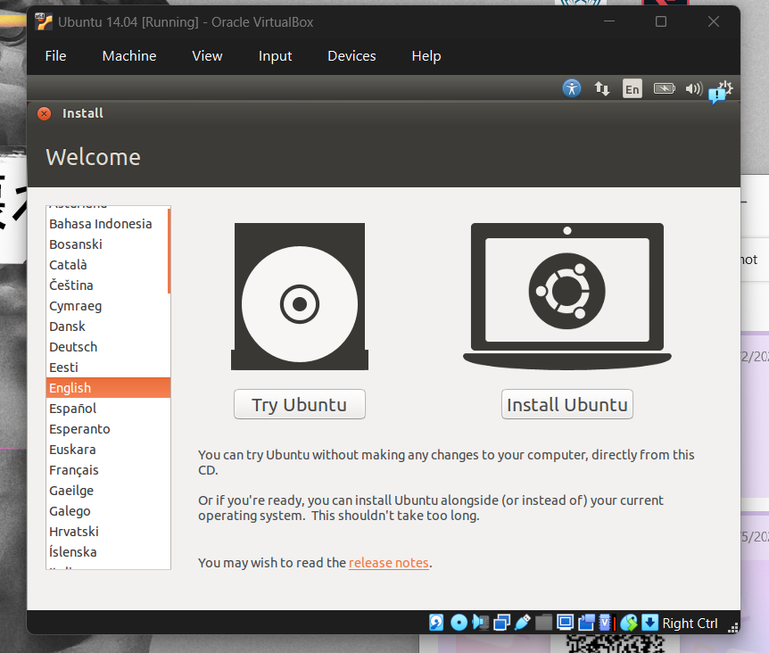
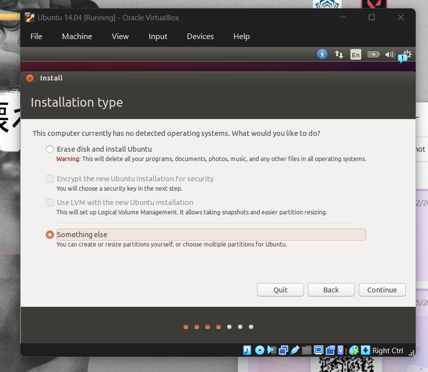
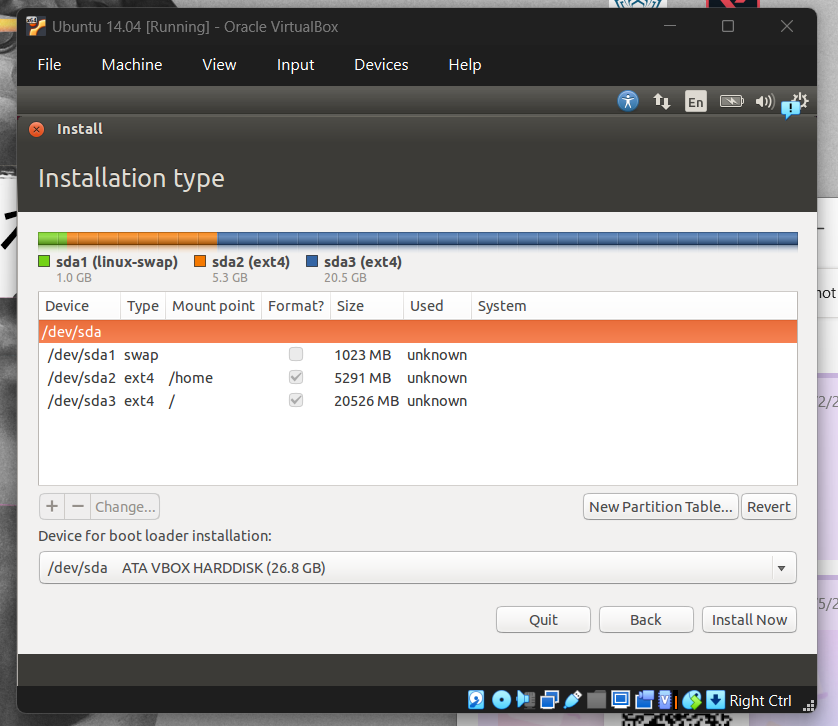
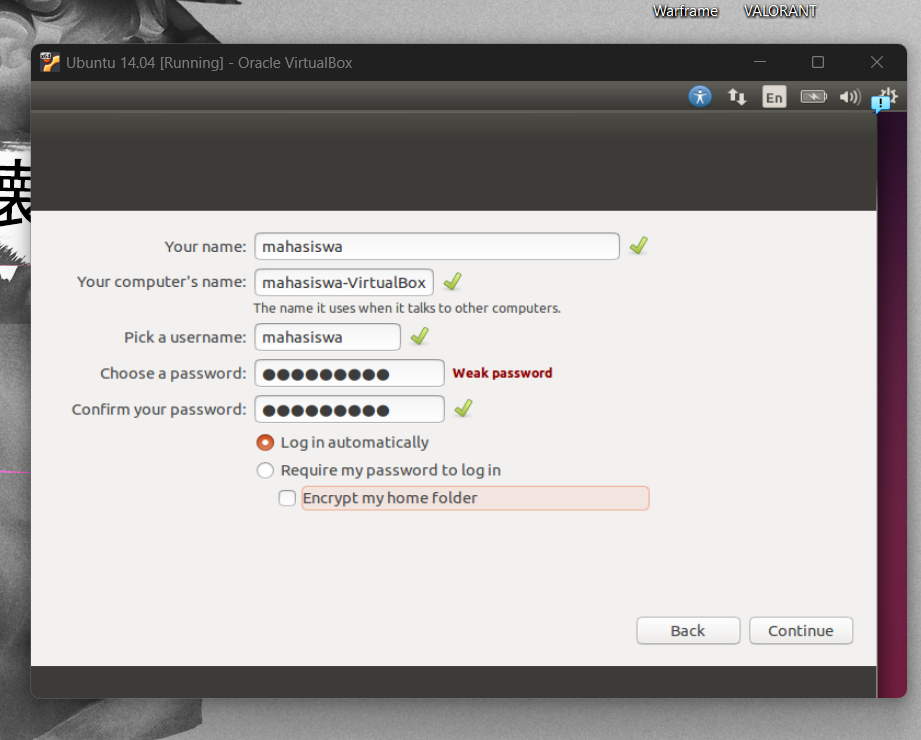
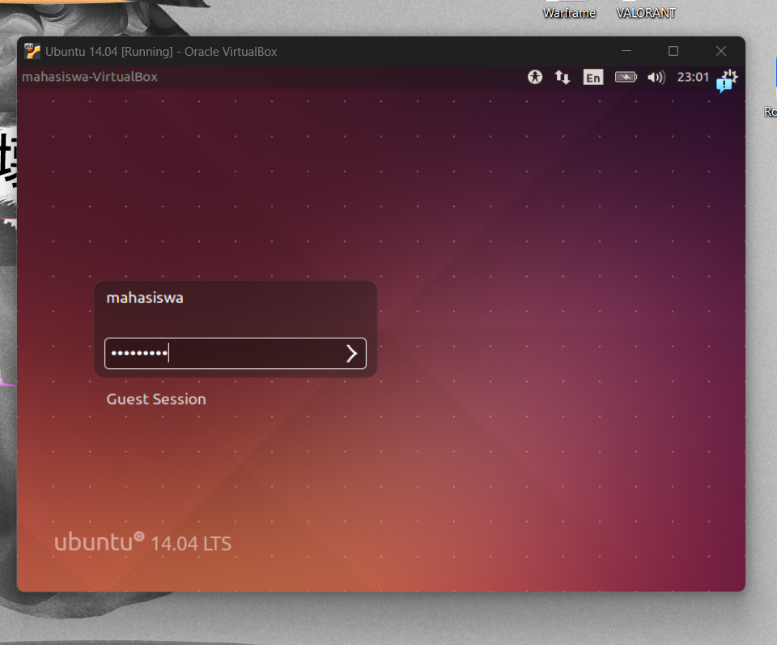

# Laporan Praktikum 1 - Sistem Operasi

**Nama**: NIK ISA BIN NIK HAZIM  
**NIM**: 03041382631180  
**Mata Kuliah**: SISTEM OPERASI  

---

## 1. Proses Instalasi Ubuntu di Komputer Mahasiswa

### Langkah-langkah Instalasi:
1. **Memulai Instalasi**: Membuka Oracle VM VirtualBox dan memuat ISO Ubuntu 14.04 LTS. Memilih opsi bahasa "English" dan memilih **Install Ubuntu**.
   

2. **Memilih Tipe Partisi**: Memilih opsi **"Something else"** untuk melakukan partisi manual terhadap hard disk virtual.
   

3. **Skema Partisi**:
   - `/dev/sda1`: `swap` (1023 MB)
   - `/dev/sda2`: `ext4` dengan mount point `/home` (5291 MB)
   - `/dev/sda3`: `ext4` dengan mount point `/` (Root) (20526 MB)
   

4. **Konfigurasi Akun Pengguna**: Mengatur nama pengguna (`mahasiswa`), nama komputer (`mahasiswa-VirtualBox`), dan sandi pengguna.
   

5. **Instalasi Selesai**: Menjalankan sistem operasi Ubuntu 14.04 LTS yang telah berhasil dipasang di VirtualBox.
   

---

## 2. Analisis Mount Point `/` (Root)

**Pertanyaan:** Analisislah pada gambar kenapa saat instalasi perlu dipilih “/” pada opsi Mount Point ?

**Jawaban:**  
the symbol “/” is like a directory. On windows, they use drive C: or D: but in linux, it install on a single giant tree. “/” is like a trunk the base of the tree.

---

## 3. Berikan penjelasan tentang ext4, ext3, swap, ntfs, fat32,btrfs !

ext4 (Extended Filesystem 4):
•	The default, standard format used by modern Linux/Ubuntu. It is fast, stable, and uses a "journal" (like an activity diary) so the files is not corrupted when suddenly the power cuts out.
•  ext3 (Extended Filesystem 3):
•	The older version of ext4. It was the first version to add the safety diary (journaling), slower and smaller storage limits compared to ext4.
•  swap (Swap Space):
•	Its an emergency backup RAM on your hard drive. If the computer runs out of RAM, Linux moves inactive apps into this swap area temporarily so your system does not freeze or crash.
•  NTFS (New Technology File System):
•	The standard file system used by Microsoft Windows other than exFAT. It is built for Windows to handle huge files, permissions, and security.
•  FAT32 (File Allocation Table 32):
•	The universal format used by almost all USB thumb drives and SD cards. All device such as Windows, Mac, Linux, TVs and consoles can read it. However, it cannot store single file larger than 4 GB.
•  btrfs (B-Tree File System):
•	A modern, high-tech Linux file system. It has advanced features like "snapshots" like a undo page or rewind if something breaks and self-healing for corrupted data.
